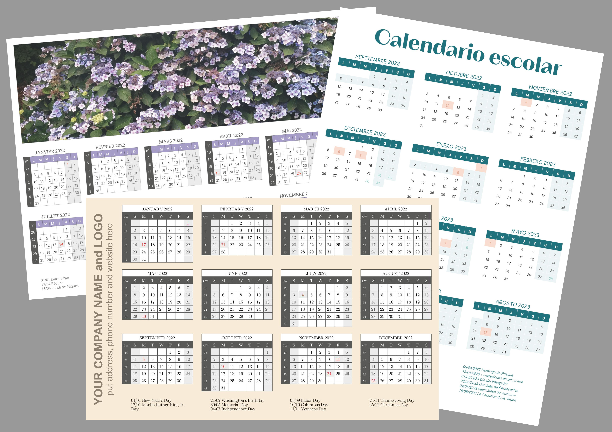

# Year-Calendar-Script-for-Scribus (for Scribus 1.5.6+)
Generates a 12-months calendar on one page in pdf or image format. 
Can be used to create credit card sized calendar, school year calendar, wall calendar, etc.
(see examples below).

1) You can choose between more than 20 languages (default is English). 
2) You can choose your font from the list of fonts available on your system. You can change
   fonts of many items afterwards in the Styles menu (Edit - Styles).
3) Calendar year, start month and week starting day are to be given. Saturdays and Sundays will 
   be printed in separate colors (many colors can be changed afterwards with Edit - Colors and Fills).
4) Option to show week numbers with (or without) a week numbers heading in your local language.
5) Option to import holidays, special days and vacation dates from a 'holidays.txt' file. 
   The 'holidays.txt' file from MonthlyCalendar script can be used here. See the example
   holiday.txt-file for the layout. Automatic calculation of the holiday dates for each calendar year.
6) Number of months per row determines the layout of the 12-month calendar.
7) You can position the 12-months calendar within your document exactly where you want it.
8) Option to draw an empty image frame within the top and / or left 'offset' area and to get an 
   'inner' margin between this frame and the calendar.
9) Option to generate a text frame at the bottom with the holiday dates and texts.
10) You can easily change the text styles, colors and fills of month title, weekday names, 
    week numbers, weekends, holidays, normal dates, special dates, vacation and grids.

Many build-in controls.
Parts of this script are taken from the MonthlyCalendar script for Scribus.

# Please read the instructions file!

